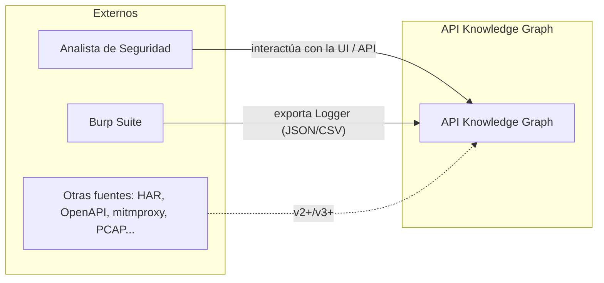
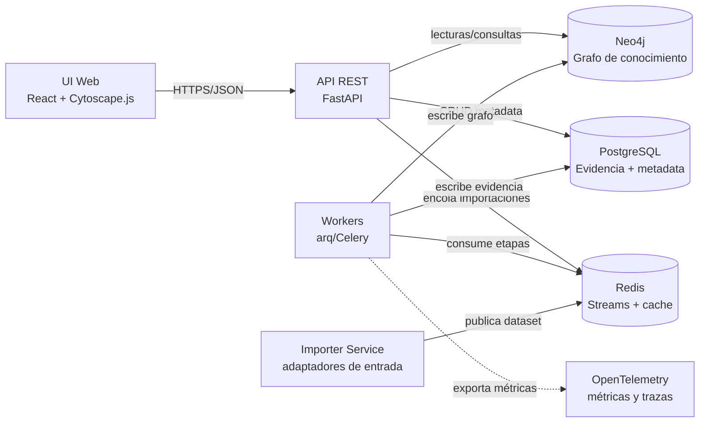
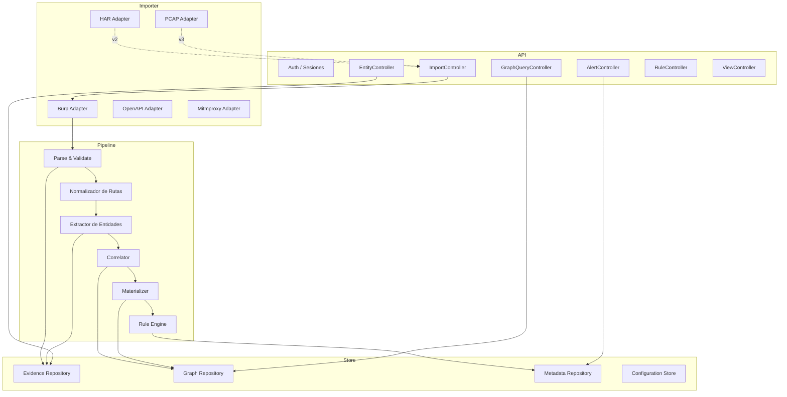
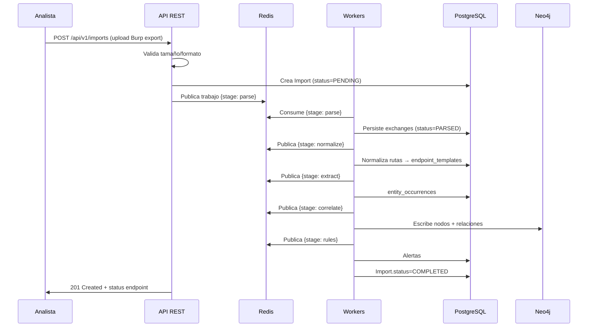

# 3. Arquitectura General

> **Capítulo 3 de 15** — Arquitectura del sistema descrita con el modelo C4 (Contexto → Contenedores → Componentes → Código), el stack tecnológico y las consideraciones de escalabilidad.

---

## 3.1 Vista de Contexto (C4 — Nivel 1)



El sistema es una **herramienta de post-procesamiento** que consume tráfico capturado por otras herramientas. No intercepta tráfico en tiempo real (non-goal NG-1).

## 3.2 Vista de Contenedores (C4 — Nivel 2)



### Descripción de contenedores

| Contenedor | Responsabilidad | Tecnología |
|------------|-----------------|------------|
| **UI Web** | Vistas navegables del grafo, alertas, timeline, consola de consultas | React 18, TypeScript, Cytoscape.js, Vite |
| **API REST** | Contratos públicos (OpenAPI), orquestación de importaciones, consultas, CRUD de configuración | Python 3.11+, FastAPI, Pydantic v2 |
| **Workers** | Ejecución de etapas del pipeline (parseo, normalización, extracción, correlación, reglas) | Python, arq/Celery, Redis Streams |
| **Importer Service** | Adaptadores de entrada: lee formatos, valida, publica en colas | Python, parsers dedicados |
| **PostgreSQL** | Capa de evidencia (requests, responses, headers, params, occurrences) + metadata | PostgreSQL 15+ |
| **Neo4j** | Grafo de conocimiento: nodos, relaciones, índices | Neo4j 5 (Community) |
| **Redis** | Streams de trabajo, cache de consultas, locks distribuidos | Redis 7 |
| **OpenTelemetry Collector** | Recepción de trazas/métricas, exportación a Prometheus/Jaeger | OTel Collector |

## 3.3 Vista de Componentes (C4 — Nivel 3)



### 3.3.1 Descripción de componentes del pipeline

| Componente | Entrada | Salida |
|------------|---------|--------|
| **Parse & Validate** | Archivo crudo (Burp/HAR) | Modelo canónico `HttpExchange[]` |
| **Normalizador de Rutas** | `HttpExchange[]` | Rutas templadas (`GET /users/{id}`) + segmentos clasificados |
| **Extractor de Entidades** | Exchanges + paths canónicos | Ocurrencias de entidades (`entity_occurrences`) |
| **Correlator** | Ocurrencias + rutas | Relaciones de grafo con confianza |
| **Materializer** | Relaciones | Escritura de nodos/relaciones en Neo4j |
| **Rule Engine** | Grafo + catálogo de reglas | Alertas (`alerts`) |

## 3.4 Flujo de datos end-to-end



## 3.5 Stack tecnológico (detalle)

### 3.5.1 Backend / núcleo

| Área | Tecnología | Versión | Notas |
|------|-----------|---------|-------|
| Lenguaje | Python | 3.11+ | Tipado estricto |
| API | FastAPI | 0.10x | OpenAPI automático |
| Validación | Pydantic | 2.x | Modelos de dominio |
| ORM | SQLAlchemy 2.0 + Alembic | 2.x | Migraciones versionadas |
| Grafo | neo4j driver | 5.x | Sincrónico + async |
| Colas | arq / Redis Streams | — | Preferencia inicial: arq |
| JSON | orjson | — | Rendimiento de parsing |
| Testing | pytest + pytest-asyncio | — | Cobertura > 85% |
| Calidad | ruff, mypy, pre-commit | — | CI obligatoria |

### 3.5.2 Frontend

| Área | Tecnología |
|------|-----------|
| Framework | React 18 + TypeScript |
| Build | Vite |
| Visualización de grafos | Cytoscape.js (primario), D3 (auxiliar para charts) |
| Estado | TanStack Query + Zustand |
| UI kit | Radix UI / shadcn |
| Tests | Vitest + React Testing Library |

### 3.5.3 Infraestructura

| Área | Tecnología |
|------|-----------|
| Contenedores | Docker + Docker Compose |
| Orquestación (v3) | Kubernetes + Helm |
| Observabilidad | OpenTelemetry, Prometheus, Grafana, Jaeger |
| CI/CD | GitHub Actions |
| Registro | GitHub Container Registry (GHCR) |

## 3.6 Modelo de ejecución y concurrencia

### 3.6.1 Estrategia de procesamiento

- **Lotes (batch) por importación**: cada importación procesa su dataset de forma independiente; los workers escalan horizontalmente por `import_id` (cada importación puede distribuirse en shards).
- **Granularidad de trabajo**: `shard = {import_id, chunk}` con chunks de N exchanges (configurable, default 5.000).
- **Idempotencia**: cada worker registra progreso en PostgreSQL (`import_stages`); reprocesar un chunk no duplica evidencia ni nodos (upsert por claves naturales).

### 3.6.2 Contratos de mensajería

Los eventos del bus (Redis Streams) siguen un esquema versionado:

```jsonc
{
  "event": "stage.ready",
  "version": 1,
  "import_id": "uuid",
  "stage": "correlate",
  "shard": 3,
  "payload": { "chunk_ids": ["uuid", "uuid"] },
  "attempt": 0
}
```

Etapas publicadas en orden: `parse → normalize → extract → correlate → materialize → rules`. Cada worker confirma el stream con `XACK` tras persistir correctamente.

### 3.6.3 Garantías

- **At-least-once**: procesar un mensaje dos veces es seguro (idempotencia).
- **Reintentos**: 3 reintentos con backoff exponencial por etapa; tras agotarse, `import.status = FAILED` con `stage_error`.
- **Dead-letter queue** (DLQ) para trabajos irreparables.

## 3.7 Estrategia de datos y almacenamiento

### 3.7.1 Capas de almacenamiento

| Capa | Motor | Contenido | Ciclo de vida |
|------|-------|-----------|---------------|
| Evidencia (fría) | PostgreSQL | Requests, responses, headers, params, occurrences | Retención configurable, redacción sensible |
| Conocimiento (activo) | Neo4j | Nodos, relaciones, hipótesis | Persistente por proyecto/importación |
| Metadata | PostgreSQL | Imports, stages, alertas, reglas, configuración | Persistente |
| Cache | Redis | Resultados de consultas frecuentes, locks | Volátil |

### 3.7.2 Sincronización entre PostgreSQL y Neo4j

- Los **IDs externos** (`import_id`, `exchange_id`, `occurrence_id`) se mantienen en las propiedades de los nodos para trazabilidad.
- La escritura a Neo4j es **final** y derivada; si se requiere re-materializar, se borra el subgrafo de esa importación y se regenera (PR-05/PR-06).
- Los nodos se identifican de forma estable mediante **claves naturales** (`(label, key)`), ver capítulo 6.

## 3.8 Escalabilidad y rendimiento

### 3.8.1 Objetivos de rendimiento (SLOs v1.0)

| Métrica | Objetivo |
|---------|----------|
| Tiempo de importación de 100k exchanges | < 10 min en hardware de referencia |
| Ingesta | > 500 exchanges/s sostenidos |
| Latencia de consulta de grafo (1 salto) | < 200 ms |
| Latencia de consulta de grafo (multi-salto, profundidad ≤ 5) | < 2 s |
| Uptime del API | 99.5% en despliegue single-node |

### 3.8.2 Estrategias de escalado

1. **Horizontal**: añadir workers por etapa (los shards se distribuyen). Neo4j puede escalar a clúster en v3+.
2. **Particionado de evidencia**: particionamiento por `import_id` en las tablas de tráfico.
3. **Cache de consultas**: patrones de consulta repetidos (vistas de autenticación, "quién usa este JWT") se cachean en Redis con invalidación por importación.
4. **Límites de profundidad**: las consultas de vista usan profundidades acotadas para mantener latencia.

### 3.8.3 Hardware de referencia (v1.0)

| Recurso | Mínimo | Recomendado |
|---------|--------|-------------|
| CPU | 4 vCPU | 8 vCPU |
| RAM | 8 GB | 16 GB |
| Disco | 50 GB | 200 GB (SSD) |
| Red | — | 1 Gbps |

## 3.9 Configuración y entornos

El sistema admite entornos mediante variables de entorno con archivo `.env` (12-factor). Perfiles:

| Entorno | Uso |
|---------|-----|
| `dev` | Desarrollo local, seed de fixtures |
| `test` | CI, BBDD en memoria/contenedores efímeros |
| `prod` | Producción, cifrado obligatorio, telemetría activa |

Configuración principal (`config.py`): conexiones, límites de upload, umbrales de normalización, política de redacción, retención, reglas habilitadas.

## 3.10 Modelo de despliegue

- **v0.1**: despliegue local con Docker Compose (api, workers, importer, ui, postgres, neo4j, redis).
- **v1.0**: imagen de distribución única con Compose; soporte de instalación sin Docker (binarios + servicios) para entornos restringidos.
- **v2.0**: separación opcional de servicios, soporte multiusuario, helm charts preliminares.
- **v3.0**: Kubernetes, alta disponibilidad, escalado elástico.

Ver detalle operativo en `12-despliegue-y-operaciones.md`.

## 3.11 Decisión de diseño: ¿por qué FastAPI y no otro framework?

Se alinea con ADR-005: tipado fuerte con Pydantic para los modelos de dominio (reutilizados entre API y workers), generación automática de OpenAPI (ADR-012), alto rendimiento mediante ASGI/uvloop, y ecosistema maduro de drivers async para Neo4j/PostgreSQL/Redis.

## 3.12 Componentes de arquitectura — requisitos no funcionales

| No-funcional | Requisito | Diseño asociado |
|--------------|-----------|-----------------|
| Seguridad | Cifrado en tránsito (TLS), redacción de secretos, auth de API | Capítulo 11 |
| Privacidad | Redacción configurable, retención, modo local | Capítulo 11 |
| Disponibilidad | Pipeline reanudable, DLQ, reinicio idempotente | Sección 3.6, capítulo 12 |
| Mantenibilidad | Esquemas versionados, contratos OpenAPI, tests | Capítulos 5, 6, 9 |
| Extensibilidad | Adaptadores pluggable, DSL de reglas | Capítulos 4, 8 |
| Rendimiento | SLOs de la sección 3.8.1 | Capítulos 4, 7, 12 |
