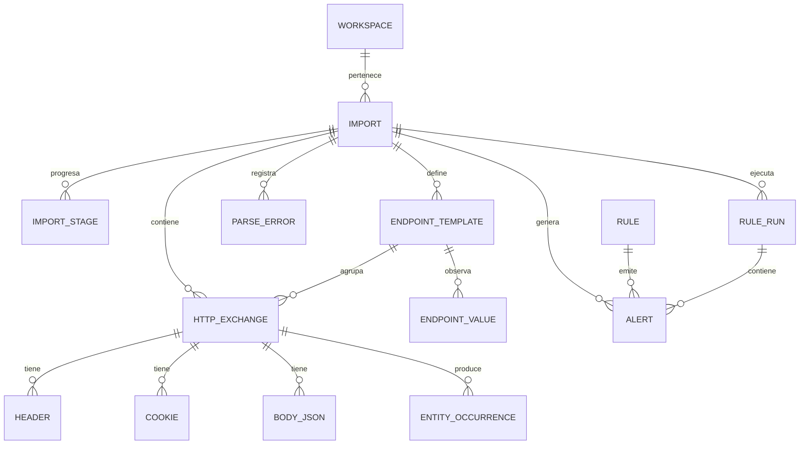

# 5. Modelo de Datos (Capa de Evidencia)

> **Capítulo 5 de 15** — Modelo de datos relacional en PostgreSQL para la capa de evidencia, metadata, reglas y alertas. El esquema del grafo (Neo4j) se describe en el capítulo 6.

---

## 5.1 Visión general

PostgreSQL almacena dos categorías de datos:

1. **Evidencia**: los exchanges HTTP, sus componentes y las ocurrencias de entidades extraídas. Es la base sobre la que se razona.
2. **Metadata y gobernanza**: importaciones, etapas, reglas, alertas, configuración, proyectos/workspaces.

El principio rector (PR-01/PR-04): la evidencia se conserva como **fuente de la verdad** para reproducibilidad y auditoría, pero el conocimiento operativo reside en el grafo.

## 5.2 ERD de alto nivel



## 5.3 Tablas de dominio

### 5.3.1 `workspaces`

Agrupa proyectos de auditoría (una auditoría puede tener varias importaciones).

| Columna | Tipo | Notas |
|---------|------|-------|
| id | uuid PK | |
| name | text | |
| description | text | |
| created_at | timestamptz | |
| updated_at | timestamptz | |
| config | jsonb | Configuración del workspace (redacción, umbrales) |

### 5.3.2 `imports`

| Columna | Tipo | Notas |
|---------|------|-------|
| id | uuid PK | Clave externa de todas las evidencias |
| workspace_id | uuid FK | |
| source_format | enum | `burp_json`, `burp_csv`, `har`, `openapi`, ... |
| source_file_name | text | |
| source_hash | text | SHA-256 del archivo original |
| status | enum | `PENDING, PARSING, PARSED, NORMALIZING, NORMALIZED, EXTRACTING, EXTRACTED, CORRELATING, CORRELATED, MATERIALIZING, MATERIALIZED, RULES, COMPLETED, FAILED, PAUSED` |
| stage_error | jsonb | Detalle del fallo si `FAILED` |
| totals | jsonb | `{exchanges, headers, cookies, occurrences, nodes, edges}` |
| pipeline_version | text | Versión del pipeline que la procesó (PR-06) |
| config | jsonb | Snapshot de configuración de importación |
| redaction_policy | jsonb | Política aplicada |
| created_at / updated_at | timestamptz | |

### 5.3.3 `import_stages`

Progreso por etapa y shard para reanudación (idempotencia).

| Columna | Tipo | Notas |
|---------|------|-------|
| id | uuid PK | |
| import_id | uuid FK | |
| stage | enum | `parse, normalize, extract, correlate, materialize, rules` |
| shard | int | Índice de shard |
| status | enum | `PENDING, RUNNING, DONE, FAILED` |
| started_at / finished_at | timestamptz | |
| processed | bigint | Contador de elementos procesados |
| UNIQUE | (import_id, stage, shard) | |

### 5.3.4 `http_exchanges`

La tabla principal de evidencia. **Particionada por `import_id`** (rango de hash o lista de imports).

| Columna | Tipo | Notas |
|---------|------|-------|
| id | uuid PK | = `exchange_id` usado en el grafo |
| import_id | uuid FK | Clave de partición |
| order | bigint | Posición en el dataset |
| timestamp | timestamptz | |
| host | text | |
| port | int | |
| scheme | text | |
| method | text | `GET, POST, PUT, DELETE, PATCH, HEAD, OPTIONS` |
| path | text | Ruta concreta |
| query_string | text | |
| template_id | uuid FK | Endpoint al que pertenece |
| path_params | jsonb | `{"userId": "15", ...}` |
| req_headers_count | int | |
| resp_status_code | int | |
| resp_headers_count | int | |
| req_has_json / resp_has_json | boolean | |
| req_body_size / resp_body_size | bigint | |
| total_ms | int | |
| client_ip | inet | Redactable |
| metadata | jsonb | Extensible |

Índices: `(import_id, order)`, `(import_id, timestamp)`, `(template_id)`, `(host)`, `(resp_status_code)`.

### 5.3.5 `http_headers`

Cabeceras normalizadas (una fila por cabecera).

| Columna | Tipo | Notas |
|---------|------|-------|
| id | bigint PK | |
| exchange_id | uuid FK | |
| direction | enum | `request, response` |
| name | text | Lowercase |
| value | text | |
| value_hash | text | Hash si sensible |
| redacted | boolean | |

Índice: `(exchange_id, direction)`, `(name, value_hash)` para búsquedas de "quién envía X".

### 5.3.6 `http_cookies`

| Columna | Tipo | Notas |
|---------|------|-------|
| id | bigint PK | |
| exchange_id | uuid FK | |
| direction | enum | `request, response` |
| name | text | |
| value | text | |
| value_hash | text | |
| attributes | jsonb | `secure, httponly, samesite, domain, path, expires` |
| redacted | boolean | |

### 5.3.7 `body_json`

Cuerpos JSON almacenados de forma estructurada.

| Columna | Tipo | Notas |
|---------|------|-------|
| id | bigint PK | |
| exchange_id | uuid FK | |
| direction | enum | `request, response` |
| content_type | text | |
| json | jsonb | Cuerpo completo (puede ser `NULL` si se redactó) |
| json_sha256 | text | Hash del cuerpo completo (fidelidad) |
| stored_bytes | int | Tamaño |
| truncated | boolean | Si excedió `skip_large_bodies_bytes` |

Índice: GIN sobre `json` (búsquedas `@>`, `?`).

### 5.3.8 `parse_errors`

| Columna | Tipo | Notas |
|---------|------|-------|
| id | bigint PK | |
| import_id | uuid FK | |
| source_line | int | Índice en el archivo original |
| error_type | text | |
| message | text | |
| raw_fragment | text | Fragmento con redacción |

### 5.3.9 `endpoint_templates`

| Columna | Tipo | Notas |
|---------|------|-------|
| id | uuid PK | = `template_id` |
| import_id | uuid FK | |
| method | text | |
| pattern | text | `/users/{userId}/orders/{orderId}` |
| host_pattern | text | |
| segments | jsonb | Clasificación por segmento |
| cardinality | jsonb | `{exchanges, distinct_values_by_param}` |
| confidence | enum | Nivel de confianza (v0.1: siempre `EVIDENCIA`) |
| created_at | timestamptz | |

UNIQUE: `(import_id, method, pattern, host_pattern)`.

### 5.3.10 `endpoint_values`

Valores concretos observados por endpoint (para análisis de enumeración, IDOR).

| Columna | Tipo | Notas |
|---------|------|-------|
| id | bigint PK | |
| template_id | uuid FK | |
| param | text | `userId` |
| value | text | `15` |
| value_hash | text | |
| first_seen | timestamptz | |
| last_seen | timestamptz | |
| count | int | |

### 5.3.11 `entity_occurrences`

**Tabla crítica para la correlación.** Registra cada ocurrencia de una entidad con su path canónico.

| Columna | Tipo | Notas |
|---------|------|-------|
| id | bigint PK | = `occurrence_id` |
| exchange_id | uuid FK | |
| import_id | uuid FK | |
| entity_type | text | `jwt, json_id, cookie, role, scope, ...` |
| entity_label | text | `customerId` |
| value | text | Puede ser `NULL` si hash-only |
| value_hash | text | SHA-256 normalizado |
| path | text | `$.data.customer.id` o `header.authorization` |
| location | enum | `request.header, request.query, request.body, request.cookie, response.header, response.body, response.cookie, path` |
| sensitive | boolean | |
| redacted | boolean | |
| first_seen / last_seen | timestamptz | |

Índices: `(entity_type, entity_label, value_hash)` (clave de agrupación), `(import_id, exchange_id)`, `(value_hash)`.

> **Normalización de valores**: el `value_hash` se calcula sobre el valor **normalizado** (trim, canonicalizado para UUID/URL) para evitar duplicados por formato. Definición en `07-motor-de-correlacion.md`.

### 5.3.12 `rules`

Catálogo de reglas (datos, no código — ADR-009).

| Columna | Tipo | Notas |
|---------|------|-------|
| id | uuid PK | |
| rule_id | text | Identificador estable (`R-IDOR-001`) |
| name | text | |
| description | text | |
| severity | enum | `CRITICA, ALTA, MEDIA, BAJA, INFO` |
| dsl | jsonb | Definición `when/where` (capítulo 8) |
| category | text | `IDOR`, `AUTH`, `TOKEN`, `DATA_EXPOSURE`, ... |
| enabled | boolean | |
| version | int | Versionado del catálogo |
| references | jsonb | OWASP refs |
| UNIQUE | (rule_id, version) | |

### 5.3.13 `rule_runs`

Ejecución del catálogo sobre una importación.

| Columna | Tipo | Notas |
|---------|------|-------|
| id | uuid PK | |
| import_id | uuid FK | |
| started_at / finished_at | timestamptz | |
| rules_checked | int | |
| alerts_created | int | |
| status | enum | `RUNNING, COMPLETED, FAILED` |

### 5.3.14 `alerts`

| Columna | Tipo | Notas |
|---------|------|-------|
| id | uuid PK | |
| import_id | uuid FK | |
| rule_id | text | Regla que la generó |
| rule_run_id | uuid FK | |
| severity | enum | |
| status | enum | `OPEN, TRIAGED, FALSE_POSITIVE, CONFIRMED, CLOSED` |
| title | text | |
| description | text | |
| evidence | jsonb | `{exchange_ids[], occurrence_ids[], node_keys[]}` |
| context_subgraph | jsonb | Subgrafo serializado (opcional) |
| confidence | float | Score del motor |
| created_at / updated_at | timestamptz | |

Índice: `(import_id, severity, status)`, `(rule_id)`.

## 5.4 Convenciones generales

- **IDs**: UUID v7 (ordenables temporalmente) para las claves de negocio; `bigint` para tablas de detalle de gran volumen.
- **Timestamps**: `timestamptz`.
- **JSONB**: para estructuras semi-estructuradas y extensibles.
- **Valores sensibles**: columna `redacted` + `value_hash` en lugar del valor cuando la política lo exige.
- **Auditoría**: `created_at`/`updated_at` en todas las tablas de metadata.

## 5.5 Estrategia de particionamiento

- `http_exchanges`: partición por rango sobre `import_id` (hash). Cada importación nueva crea/usa su partición.
- `entity_occurrences`: partición por `import_id`.
- `http_headers`, `http_cookies`, `body_json`: por `import_id` indirecto (FK) — en v0.1 se mantienen como tablas normales con índice `(exchange_id)`; se evalúa particionar en v1 si el volumen lo exige.

## 5.6 Migraciones

- **Alembic** gestiona el esquema relacional.
- Cada migración versionada (`alembic_version`), reversible.
- El esquema del grafo (Neo4j) se versiona por separado (capítulo 6) con **scripts de idempotencia Cypher**.

## 5.7 Modelo de datos del conocimiento vs. evidencia

| Aspecto | Evidencia (PostgreSQL) | Conocimiento (Neo4j) |
|---------|------------------------|-----------------------|
| Contenido | Requests, bodies, ocurrencias | Nodos, relaciones, hipótesis |
| Naturaleza | Fuente de la verdad, reproducible | Derivada, agregada, navegable |
| Actualización | Insert-only, política de retención | Re-materializable |
| Consulta | SQL, búsqueda por valor/hash | Cypher, recorridos |
| Ciclo de vida | Retención configurable | Persistente por workspace |

## 5.8 Búsqueda de texto sobre evidencias

- Índices `GIN` con `tsvector` sobre `path`, `host`, `entity_label` y `header.name`.
- Consultas "¿dónde aparece el valor X?" resueltas primero por `value_hash` (índice hash) y luego filtradas.

## 5.9 Ejemplo de consulta de correlación (SQL base)

```sql
-- ¿Qué endpoints utilizan el mismo JWT?
SELECT et.method, et.pattern,
       count(DISTINCT he.id) AS uses
FROM entity_occurrences eo
JOIN http_exchanges he ON he.id = eo.exchange_id
JOIN endpoint_templates et ON et.id = he.template_id
WHERE eo.entity_type = 'jwt'
  AND eo.value_hash = $1      -- hash del JWT buscado
  AND eo.import_id = $2
GROUP BY et.method, et.pattern
ORDER BY uses DESC;
```

Esta consulta alimenta la vista de "propagación de tokens" (capítulo 10).
