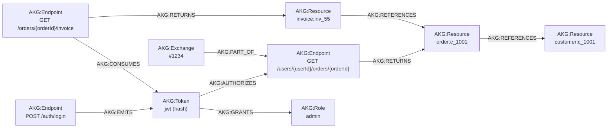

# 6. Esquema del Grafo de Conocimiento

> **Capítulo 6 de 15** — Definición formal del esquema del grafo en Neo4j: tipos de nodo, tipos de relación, propiedades, índices, restricciones y ejemplos. Es la especificación central sobre la que trabajan la correlación, las reglas y la UI.

---

## 6.1 Propósito

El grafo es el **artefacto de conocimiento** del sistema (PR-01). Contiene entidades observadas o inferidas (nodos) y las relaciones entre ellas (aristas), cada una con un nivel de confianza explícito (ADR-006).

## 6.2 Reglas de diseño del esquema

1. **Clave natural estable**: cada nodo tiene una clave natural que lo identifica de forma idempotente (`MERGE`).
2. **Confianza explícita**: todo nodo/relación con nivel de confianza y, opcionalmente, `score` y `evidence` (referencias).
3. **Trazabilidad**: propiedades `import_id`, `exchange_id` (o `occurrence_id`) en los elementos derivados de evidencia.
4. **Namespaced**: todos los labels llevan prefijo para evitar colisiones futuras. Se usa el prefijo `AKG` (API Knowledge Graph) en labels y tipos de relación.
5. **Versionado**: el esquema se define por scripts de idempotencia Cypher versionados (`schemas/neo4j/v1.cypher`).

## 6.3 Tipos de nodos

### 6.3.1 Nodos de infraestructura

| Label | Propiedades clave | Clave natural |
|-------|-------------------|---------------|
| `AKG:Host` | `name`, `scheme`, `port`, `tls_version`, `import_id` | `(name)` |
| `AKG:Service` | `name`, `kind` (microservice/gateway/bff), `import_id` | `(name)` |
| `AKG:Subdomain` | `name`, `parent` | `(name)` |
| `AKG:External` | `name`, `kind` (CDN/auth provider/payment/payment gateway/...) | `(name)` |

### 6.3.2 Nodos de API

| Label | Propiedades clave | Clave natural |
|-------|-------------------|---------------|
| `AKG:Endpoint` | `method`, `pattern`, `host`, `param_keys[]`, `auth_required` (inferido), `scopes_required[]`, `import_id` | `(method, pattern, host)` |
| `AKG:PathParam` | `name`, `class` (numeric/uuid/hash/fixed), `template_id` | `(template_id, name)` |
| `AKG:QueryParam` | `name`, `cardinality`, `types[]` | `(endpoint_id, name)` |
| `AKG:HeaderParam` | `name`, `direction`, `cardinality` | `(endpoint_id, name, direction)` |
| `AKG:BodyField` | `path` (canónico), `types[]`, `cardinality` | `(endpoint_id, path)` |

### 6.3.3 Nodos de entidades de seguridad

| Label | Propiedades clave | Clave natural |
|-------|-------------------|---------------|
| `AKG:Token` | `token_type` (jwt/opaque/api_key/oauth/refresh/bearer), `value_hash`, `payload_summary` (redactado), `issuer`, `subject`, `audience[]`, `exp`, `nbf`, `alg`, `claims[]` (nombres, no valores), `scopes[]`, `roles[]` | `(token_type, value_hash)` |
| `AKG:Cookie` | `name`, `value_hash`, `domain`, `path`, `secure`, `httponly`, `samesite` | `(name, value_hash)` |
| `AKG:Session` | `session_id_hash`, `kind` (session/jwt-refresh), `created_at` | `(session_id_hash)` |
| `AKG:Principal` | `kind` (user/service/account), `principal_hash` (hash de ID de usuario), `username_redacted`, `roles[]`, `email_hash` | `(kind, principal_hash)` |
| `AKG:Role` | `name`, `source` (jwt/body/header) | `(name)` |
| `AKG:Scope` | `name`, `source` | `(name)` |
| `AKG:OAuthFlow` | `grant_type`, `provider`, `client_id_hash` | `(grant_type, provider, client_id_hash)` |

### 6.3.4 Nodos de recursos de negocio

| Label | Propiedades clave | Clave natural |
|-------|-------------------|---------------|
| `AKG:Resource` | `resource_key` (tipo + valor normalizado, p. ej. `order:c_1001`), `resource_type` (inferido del path), `value_hash`, `module[]` (módulos donde aparece) | `(resource_key)` |
| `AKG:BusinessObject` | `object_type` (order/customer/invoice/...), `key_hash`, `attributes_schema` (paths de campos vistos) | `(object_type, key_hash)` |
| `AKG:File` | `name`, `content_type`, `size`, `sha256`, `downloadable` | `(sha256)` |
| `AKG:SensitiveField` | `path`, `kind` (pii/secret/card/credential), `appearances` | `(path)` |

### 6.3.5 Nodos de flujo y evidencia

| Label | Propiedades clave | Clave natural |
|-------|-------------------|---------------|
| `AKG:AuthFlow` | `flow_type` (login/refresh/logout/oauth), `provider`, `steps[]` | `(import_id, flow_type, provider)` |
| `AKG:Exchange` | `exchange_id`, `order`, `timestamp`, `method`, `path`, `status_code`, `import_id` | `(exchange_id)` |
| `AKG:Workspace` | `name` | `(name)` |

### 6.3.6 Nodos de hipótesis

| Label | Propiedades clave | Clave natural |
|-------|-------------------|---------------|
| `AKG:Hypothesis` | `hyp_type` (missing_method, resource_relation, privilege, ...), `payload` (jsonb), `rationale` | `(hyp_type, payload_key)` |

## 6.4 Tipos de relaciones

### 6.4.1 Relaciones de infraestructura

| Tipo de relación | Origen → Destino | Semántica |
|------------------|------------------|-----------|
| `AKG:HOSTS` | `Host` → `Endpoint` | El host sirve el endpoint |
| `AKG:BELONGS_TO` | `Endpoint` → `Service` | El endpoint pertenece al servicio |
| `AKG:ROUTES_TO` | `Service` → `Service` | Llamada entre servicios |
| `AKG:RESOLVES_TO` | `Service` → `Host` | El servicio se sirve en el host |
| `AKG:IS_GATEWAY_FOR` | `Service` → `Service` | Gateway delante del servicio |
| `AKG:EXPOSES` | `Service` → `External` | El servicio consume el externo |

### 6.4.2 Relaciones de endpoint

| Tipo | Origen → Destino | Semántica |
|------|------------------|-----------|
| `AKG:HAS_PARAM` | `Endpoint` → `PathParam/QueryParam/HeaderParam` | Declara un parámetro |
| `AKG:HAS_FIELD` | `Endpoint` → `BodyField` | Cuerpo contiene el campo |
| `AKG:RETURNS` | `Endpoint` → `Resource/BusinessObject/File` | Devuelve el objeto |
| `AKG:ACCEPTS` | `Endpoint` → `Resource/BusinessObject` | Recibe el objeto en request |
| `AKG:REQUIRES` | `Endpoint` → `Scope/Role` | Requiere permiso |

### 6.4.3 Relaciones de seguridad

| Tipo | Origen → Destino | Semántica |
|------|------------------|-----------|
| `AKG:EMITS` | `Endpoint` → `Token/Cookie/Session` | El endpoint emite el token/cookie (login, refresh) |
| `AKG:CONSUMES` | `Endpoint` → `Token/Cookie/Session` | El endpoint usa el token/cookie (Authorization) |
| `AKG:AUTHORIZES` | `Token` → `Endpoint` | El token autoriza el endpoint (relación derivada de CONSUMES) |
| `AKG:GRANTS` | `Token` → `Role/Scope` | El token contiene el rol/scope |
| `AKG:BELONGS_TO` | `Token/Cookie/Session` → `Principal` | Pertenencia del principal (inferida) |
| `AKG:PROTECTS` | `Principal/Role/Scope` → `Endpoint` | Guarda el endpoint (inferido de ACL observada) |
| `AKG:ISSUED_BY` | `Token` → `Endpoint/External` | Emisor del token (iss) |
| `AKG:REFRESHES` | `Token` → `Token` | Refresh token renueva access token |

### 6.4.4 Relaciones de recursos

| Tipo | Origen → Destino | Semántica |
|------|------------------|-----------|
| `AKG:REFERENCES` | `Resource` → `Resource` | Un recurso referencia a otro (order → customer) |
| `AKG:UTILIZED_BY` | `Resource` → `Endpoint` | El recurso es utilizado/recorrido por el endpoint |
| `AKG:COMPOSES` | `BusinessObject` → `Resource` | El objeto contiene el recurso |
| `AKG:LINKS_TO` | `Resource` → `Resource` | Mismo valor en distintos módulos (correlación) |

### 6.4.5 Relaciones de flujo y temporalidad

| Tipo | Origen → Destino | Semántica |
|------|------------------|-----------|
| `AKG:NEXT` | `Exchange` → `Exchange` | Sucesión temporal (caminos de navegación) |
| `AKG:FOLLOWS` | `AuthFlow` → `AuthFlow` | Orden de flujos de autenticación |
| `AKG:PART_OF` | `Exchange` → `AuthFlow` | El exchange pertenece a un flujo de auth |
| `AKG:HAS_STEP` | `AuthFlow` → `Endpoint` | El flujo usa el endpoint |

### 6.4.6 Relaciones de hipótesis

| Tipo | Origen → Destino | Semántica |
|------|------------------|-----------|
| `AKG:PREDICTS` | `Endpoint` → `Hypothesis` | Sugiere métodos/relaciones no observados |
| `AKG:SUGGESTS` | `Hypothesis` → `Endpoint/Resource` | Objetivo de la hipótesis |

## 6.5 Propiedades comunes

Toda relación y nodo llevan:

```jsonc
{
  "confidence": "EVIDENCIA",        // EVIDENCIA | INFERENCIA | HIPOTESIS
  "score": 0.97,                    // [0,1] fuerza
  "import_id": "uuid",
  "first_seen": "rfc3339",
  "last_seen": "rfc3339",
  "evidence": {                      // referencias a evidencia
    "exchange_ids": ["uuid", "uuid"],
    "occurrence_ids": ["bigint"],
    "count": 42
  }
}
```

## 6.6 Índices y restricciones (Cypher de arranque)

```cypher
// Restricciones de unicidad (claves naturales)
CREATE CONSTRAINT IF NOT EXISTS FOR (e:AKG:Endpoint)  REQUIRE (e.method, e.pattern, e.host) IS UNIQUE;
CREATE CONSTRAINT IF NOT EXISTS FOR (h:AKG:Host)       REQUIRE h.name IS UNIQUE;
CREATE CONSTRAINT IF NOT EXISTS FOR (s:AKG:Service)    REQUIRE s.name IS UNIQUE;
CREATE CONSTRAINT IF NOT EXISTS FOR (t:AKG:Token)      REQUIRE (t.token_type, t.value_hash) IS UNIQUE;
CREATE CONSTRAINT IF NOT EXISTS FOR (r:AKG:Resource)   REQUIRE r.resource_key IS UNIQUE;
CREATE CONSTRAINT IF NOT EXISTS FOR (p:AKG:Principal)  REQUIRE (p.kind, p.principal_hash) IS UNIQUE;

// Índices para búsquedas frecuentes
CREATE INDEX IF NOT EXISTS FOR (e:AKG:Endpoint) ON (e.pattern);
CREATE INDEX IF NOT EXISTS FOR (t:AKG:Token)    ON (t.value_hash);
CREATE INDEX IF NOT EXISTS FOR (r:AKG:Resource) ON (r.resource_type);
CREATE INDEX IF NOT EXISTS FOR (e:AKG:Exchange) ON (e.timestamp);
CREATE INDEX IF NOT EXISTS FOR (e:AKG:Endpoint) ON (e.import_id);
```

## 6.7 Ejemplo de subgrafo



## 6.8 Versionado del esquema

| Versión de esquema | Cambios |
|--------------------|---------|
| `v1` (v0.1 del producto) | Labels base, confianza, host/endpoint/token/resource/cookie, exchanges |
| `v2` (v1.0) | Principal, Role/Scope, AuthFlow, hipótesis básicas, Service |
| `v3` (v2.0) | OAuthFlow, External, BodyField avanzado, múltiples workspaces, GDS |
| `v4` (v3.0) | Multi-tenant, versionado de datasets, streaming de cambios |

Cada versión incluye script de migración idempotente + script de validación (`db.schema.assert`).

## 6.9 Lectura/escritura desde el código

- **Escritura**: solo el `Materializer` (etapa 4) escribe en Neo4j, en modo batch.
- **Lectura**: la API (capítulo 9) y el motor de reglas (capítulo 8) leen vía Cypher parametrizado.
- **Convención de acceso**: toda consulta pasa por el repositorio de grafos (`GraphRepository`) con queries parametrizadas y límites de profundidad (evita recorridos explosivos).

## 6.10 Modelo de confianza aplicado al esquema

| Confianza | Aplicación en el esquema |
|-----------|--------------------------|
| `EVIDENCIA` | Relaciones observadas: `EMITS`, `CONSUMES`, `RETURNS`, `HAS_PARAM` con `evidence.exchange_ids` |
| `INFERENCIA` | `AUTHORIZES`, `BELONGS_TO`, `UTILIZED_BY`, `REFERENCES` (mismo valor, diferentes módulos), `PROTECTS` |
| `HIPOTESIS` | `PREDICTS` de métodos faltantes, relaciones de permisos no confirmadas |

## 6.11 Consultas canónicas (ejemplos Cypher)

**¿Qué endpoints usan el mismo JWT?**

```cypher
MATCH (t:AKG:Token {token_type:'jwt'})
MATCH (t)-[:AKG:CONSUMES]->(e:AKG:Endpoint)
WHERE t.value_hash = $hash AND e.import_id = $import
RETURN e.method, e.pattern, count(*) AS uses
ORDER BY uses DESC
```

**Recorrido completo de una factura (profundidad 4)**

```cypher
MATCH p = (r:AKG:Resource {resource_key: $key})-[:AKG:REFERENCES|AKG:RETURNS|AKG:UTILIZED_BY*1..4]->(n)
RETURN p
LIMIT 100
```

**Endpoints sin autenticación observada (base de la regla R-AUTH-001)**

```cypher
MATCH (e:AKG:Endpoint {import_id: $import})
WHERE NOT (e)<-[:AKG:CONSUMES|AKG:EMITS]-(:AKG:Token)
  AND NOT (e)<-[:AKG:CONSUMES]-(:AKG:Cookie)
RETURN e.method, e.pattern, e.host
```
