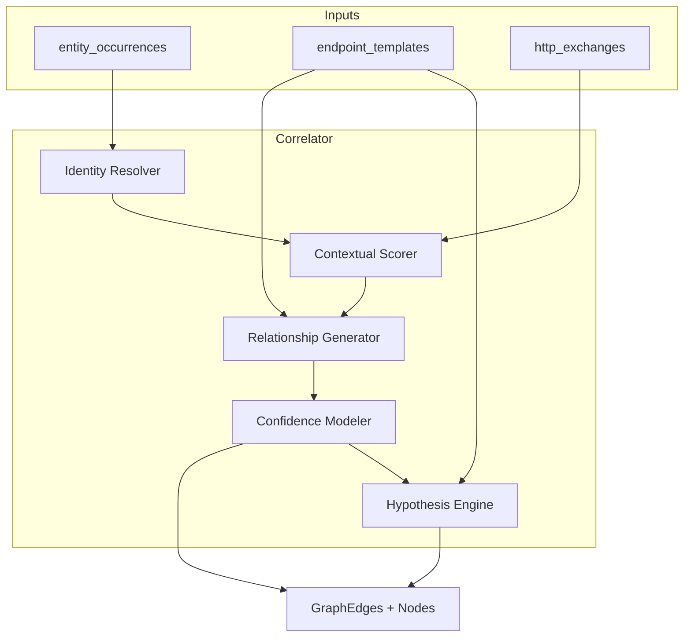

# 7. Motor de Correlación

> **Capítulo 7 de 15** — El corazón del proyecto: cómo el sistema transforma evidencia en relaciones, aplica niveles de confianza y construye el grafo de conocimiento.

---

## 7.1 Objetivo

El motor de correlación responde a la pregunta central del proyecto:

> **¿Cómo convierto miles de peticiones HTTP dispersas en un modelo navegable del comportamiento de la aplicación?**

Lo hace combinando cuatro sub-técnicas:

1. **Resolución de identidad de valores** (qué valores son "el mismo").
2. **Correlación contextual** (dónde/cómo aparece un valor → qué relación genera).
3. **Modelado de confianza** (qué tan seguro estoy de una relación).
4. **Generación de hipótesis** (qué recursos pueden existir aunque no los vi).

## 7.2 Arquitectura interna



## 7.3 Resolución de identidad de valores

### 7.3.1 Normalización de valores

Antes de correlacionar, todo valor se normaliza para que "el mismo valor en formato distinto" se unifique:

| Tipo | Normalización |
|------|---------------|
| Números | Trim, sin ceros a la izquierda |
| UUIDs | lowercase, sin llaves |
| URLs | lowercasing de host, canonicalización |
| Emails | lowercase, trim |
| JSON strings | unescape, trim |

El resultado se convierte en `value_hash = sha256(normalized)`.

### 7.3.2 Familias de equivalencia

Un valor puede aparecer con **nombres de campo distintos** que se refieren a lo mismo. El resolver construye **familias de equivalencia** de labels:

```
{customerId, customer_id, customerID, customerIdRef, "data.customer.id"} → familia customerId
```

Reglas de agrupación:
- Canonicalización de nombres (`snake_case`, `camelCase`, lower).
- Sufijos/prefixes (`Id`, `ID`, `id`, `Ref`, `Uuid`).
- Contexto de path (un `id` bajo `$.customer.*` es `customerId`).
- Sinónimos conocidos por dominio (configurable).

### 7.3.3 Pivot por `(entity_type, family, value_hash)`

Toda correlación de valor agrupa por esta clave triple. Si dos ocurrencias comparten la clave, comparten identidad.

## 7.4 Contextual Scorer

Determina **qué tipo de relación** genera cada aparición según el contexto:

| Contexto de aparición | Relación generada |
|-----------------------|-------------------|
| Token en `Authorization: Bearer` de request | `CONSUMES` (token→endpoint) |
| Token/refresh en body de respuesta del login | `EMITS` (endpoint→token) |
| Token en body de respuesta de refresh | `EMITS` + `REFRESHES` (token→token) |
| Cookie `session` en request | `CONSUMES` (cookie→endpoint) |
| Cookie `session` en `Set-Cookie` de respuesta | `EMITS` |
| Campo `json_id` en body de respuesta | `RETURNS` (endpoint→resource) |
| Campo `json_id` en body de request | `ACCEPTS` (endpoint→resource) |
| `resourceType` presente en path de endpoint y valor en body | `UTILIZED_BY` |
| Mismo recurso en 2+ endpoints/módulos | `REFERENCES`/`LINKS_TO` |
| Conjunto request→response del mismo exchange | `RETURNS`/`ACCEPTS` directos |

El scorer asigna una **evidencia primaria** a cada relación (exchange_id + occurrence_ids).

## 7.5 Generador de relaciones

### 7.5.1 Tipos de generadores

| Generador | Descripción |
|-----------|-------------|
| `TokenUsage` | `EMITS` en emisión; `CONSUMES` en uso; deriva `AUTHORIZES` |
| `CookieUsage` | Igual para cookies |
| `ResourcePresence` | `RETURNS`/`ACCEPTS` según dirección |
| `ResourceReferences` | Recurso que referencia a otro (paths anidados, URLs en body) |
| `CrossModule` | Mismo valor en endpoints de módulos distintos → `LINKS_TO` |
| `SequentialFlow` | `NEXT` entre exchanges ordenados por timestamp (mismo host/sesión) |
| `AuthFlowDetection` | Reconocimiento de flujos login/refresh/logout por endpoints y `EMITS` |
| `PermissionBinding` | Endpoints que requieren el token con ciertos scopes → `REQUIRES`/`PROTECTS` |
| `ServiceBinding` | Agrupación por host → `BELONGS_TO`, `HOSTS`, `ROUTES_TO` |

### 7.5.2 Algoritmo principal (pseudocódigo)

```
function correlate(import):
    occurrences = load_occurrences(import)
    templates  = load_templates(import)

    for each family in group_by(occurrences, key=(type, family, value_hash)):
        node = upsert_node(family)                        # MERGE por clave natural
        for each occ in family:
            endpoint = endpoint_of(occ)                   # via exchange → template
            rel = contextual_scorer(occ, endpoint)        # tipo de relación
            if rel: add_edge(node, endpoint, rel, occ)    # con evidence_ids

    # relaciones cruzadas
    for each pair (r1, r2) in same_value_cross_module():
        add_edge(r1, r2, 'LINKS_TO', confidence='INFERENCIA')

    # flujos temporales
    for each session_chain in build_chains(import):
        add_edge(chain[i], chain[i+1], 'NEXT')

    return edges
```

## 7.6 Modelo de confianza

### 7.6.1 Definición formal

Cada relación tiene:

```
confidence ∈ {EVIDENCIA, INFERENCIA, HIPOTESIS}
score ∈ [0,1]
evidence_ids = [...]
```

| Nivel | Regla de asignación | Score base |
|-------|---------------------|------------|
| `EVIDENCIA` | Observada directamente en ≥ 1 exchange (el valor aparece literalmente) | 1.0 |
| `INFERENCIA` | Derivada de correlación estadística/estructural (≥ `min_occurrences_for_inference`, consistencia de patrón) | 0.6–0.95 |
| `HIPOTESIS` | Conjetura basada en patrones de API (CRUD incompleto, permisos plausibles) | 0.3–0.5 |

### 7.6.2 Refinamiento del score

El `score` base se ajusta por factores:

| Factor | Efecto |
|--------|--------|
| Nº de ocurrencias que la sustentan | +0.05 × log2(n) |
| Consistencia temporal (todas en ventana de sesión) | +0.05 |
| Dirección coherente (emisión antes que uso) | +0.05 |
| Conflicto con relación contradictoria | −0.2 |
| Valor sintético (alto volumen en distintos endpoints) | −0.1 (posible ruido) |

Clamp final a `[0,1]`. Umbral de descarte: relaciones con `score < 0.3` se registran como candidatos pero no se materializan (se revisan si el analista lo pide).

## 7.7 Hipótesis del motor

### 7.7.1 Fuentes de hipótesis

1. **Métodos CRUD incompletos**: dado `GET /users/{id}` y `POST /users`, se hipotetiza `PUT /users/{id}`, `DELETE /users/{id}`. Clasificación por convención REST.
2. **Recursos relacionales**: dado `GET /users/{userId}/orders`, se hipotetiza `GET /users/{userId}`, `GET /orders/{orderId}`.
3. **Permisos plausibles**: endpoints sin auth observada pero con recursos sensibles → hipótesis de falta de control.
4. **Relaciones transitivas**: si `A→B` y `B→C`, hipotetizar `A→C` (solo como hipótesis, nunca como inferencia).

### 7.7.2 Representación

`AKG:Hypothesis` con `payload` y `PREDICTS`/`SUGGESTS`. Las hipótesis **nunca** se promueven a evidencia automáticamente; requieren confirmación del analista o nueva evidencia.

## 7.8 Correlación temporal y flujos

### 7.8.1 Cadenas de navegación

Se construyen cadenas de exchanges del mismo `Principal` (por cookie/sesión/token) ordenados por timestamp, con ventana de inactividad configurable (default 30 min). De ahí se derivan:

- `NEXT` entre exchanges.
- Detección de `AuthFlow` (login → JWT → uso → refresh → logout).
- "Recorrido completo" de un objeto de negocio (reconstrucción pedido→pago→factura).

### 7.8.2 Detección de flujos de autenticación

| Señal | Flujo |
|-------|-------|
| `POST /auth/login` + body con credenciales + response con token | `login` |
| Response de login contiene `refresh_token` | `login` con refresh |
| `POST /auth/refresh` con refresh_token → nuevo access_token | `refresh` |
| `POST /auth/logout` | `logout` |
| `Authorization` con `OAuth` / flujo OAuth PKCE en query | `oauth` |

## 7.9 Normalización de host → servicio

Reglas heurísticas para agrupar hosts en servicios:

1. Subdominios de tercer nivel: `orders-api.example.com` → servicio `orders`.
2. Prefijos en path: `/api/orders/...` bajo host común → servicio `orders`.
3. Agrupación por convención de versionado (`/v1/orders`, `/v2/orders`).
4. Hosts con estructura de gateway (`api`, `gateway`) → nodo gateway con `IS_GATEWAY_FOR`.

La confianza de `Service` es `INFERENCIA` (basada en convenciones) y es revisable.

## 7.10 Gestión de falsos positivos y ruido

| Problema | Mitigación |
|----------|------------|
| Tokens de ejemplo/plantilla repetidos (`Bearer test`, `123`) | Lista negra de valores sintéticos; umbral de entropía mínima |
| IDs genéricos (`1`, `2`) usados en todo | Penalización por baja entropía del valor |
| Valores que son fechas/versiones (confundidos con IDs) | Clasificación de tipo (fecha, semver) para no tratarlos como recursos |
| Sobre-normalización de rutas | Ver ADR-007 y configuración de umbrales |
| Sesiones compartidas (proxy/SSO) | No deducir `BELONGS_TO` de una sola cookie; requerir consistencia |

## 7.11 Estimación de coste y rendimiento

| Operación | Coste (100k exchanges) |
|-----------|------------------------|
| Carga de ocurrencias | ~1–2 min (indexada por import_id) |
| Agrupación por familia | En memoria, streaming; ~O(n) |
| Upsert de nodos | Batch Cypher (UNWIND), ~2 min |
| Relaciones cruzadas | `n_distinct_values × endpoints`, indexado |
| Cadenas temporales | Ordenación por (principal, timestamp), ~1 min |
| Hipótesis | Recorrido de templates CRUD, < 1 min |

## 7.12 Determinismo y reproducibilidad (PR-06)

- El motor es **determinista** para un mismo (import, config, pipeline_version).
- La ordenación interna siempre es estable (por `(order, exchange_id)`).
- Cada ejecución registra `pipeline_version` en `imports`; los cambios en el motor incrementan la versión y permiten re-correlacionar datasets existentes.

## 7.13 Validación de la correlación (fase de investigación)

Se define un **dataset de referencia** (golden dataset) con relaciones etiquetadas manualmente para medir:

- **Precisión** = relaciones correctas / relaciones generadas (objetivo > 90%).
- **Recall** = relaciones correctas encontradas / total etiquetadas.
- **F1** combinado.

Estos resultados se publican como parte del proyecto de investigación (objetivo NO-2 / criterios de éxito del capítulo 1).
