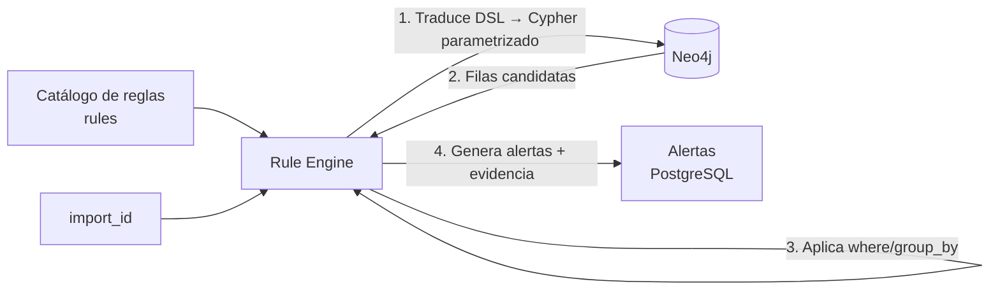

# 8. Sistema de Reglas

> **Capítulo 8 de 15** — El motor que convierte el conocimiento del grafo en alertas de seguridad accionables, mediante un DSL declarativo y extensible.

---

## 8.1 Objetivo

Sobre el grafo materializado se ejecutan reglas automáticas que detectan patrones de riesgo (reutilización de tokens, potenciales IDOR/BOLA, endpoints sin autenticación, recursos sensibles expuestos, etc.). El resultado son **alertas enriquecidas con contexto del grafo**.

## 8.2 Filosofía de diseño (ADR-009)

- **Reglas = datos, no código.** El catálogo vive en la base de datos (`rules`) y en archivos versionados dentro del repo.
- **DSL declarativo**: la regla describe *qué* buscar (patrón de grafo + filtros + salida), no *cómo*.
- **Ejecución segura**: el `when` usa un sub-lenguaje de patrones sobre Cypher, sin acceso a código arbitrario.
- **Versión del catálogo**: cada ejecución registra qué versión de reglas se usó (reproducibilidad).

## 8.3 Estructura de una regla

```yaml
rule_id: R-IDOR-001
version: 1
name: "IDOR potencial en parámetro de recurso"
category: IDOR
severity: ALTA
enabled: true
description: >
  Un endpoint parametrizado por ID de recurso devuelve un objeto
  referenciado por un valor que también aparece en otros módulos,
  sin señal clara de autorización por scope.
when:
  - match: >
      MATCH (e:AKG:Endpoint {import_id: $import_id})
      MATCH (e)-[:AKG:HAS_PARAM]->(p:AKG:PathParam {class:'numeric'})
      MATCH (e)-[:AKG:RETURNS]->(r:AKG:Resource)
      WHERE r.appearances > 1
      RETURN e.method, e.pattern, p.name, r.resource_type, count(r) AS uses
where:
  uses: { gte: 2 }
group_by: [pattern]
emit:
  title: "IDOR potencial: {pattern} accede a {resource_type}"
  severity: ALTA
  evidence:
    exchange_ids: true
    node_keys: true
  references:
    - "OWASP API-1 Broken Object Level Authorization"
    - "https://owasp.org/API-Security/editions/2023/en/0xa1-broken-object-level-authorization/"
mitigation: "Validar autorización a nivel de objeto en el servidor."
```

## 8.4 DSL — gramática

El DSL define tres bloques:

| Bloque | Tipo | Descripción |
|--------|------|-------------|
| `when` | lista de `match` (Cypher restringido) | Patrones de grafo que producen filas candidatas |
| `where` | mapa de filtros | Condiciones sobre los campos emitidos por `when` |
| `emit` | mapa | Título templado, severidad, evidencias, referencias, mitigación |

### 8.4.1 Restricciones de `match`

- Solo `MATCH` (no `CREATE`/`DELETE`/`SET`). Lectura estricta.
- Parámetros permitidos: `$import_id` (inyectado por el motor). Cualquier otra `$var` debe declararse en `params`.
- `RETURN` con alias explícito; campos usados en `where`, `group_by` o `emit`.
- Límite de filas por regla (default 5000) para evitar alertas masivas.
- Profundidad de patrón ≤ 5.
- Prohibido: `db.`, `apoc.` con escritura, funciones no-whitelist.

### 8.4.2 Operadores de `where`

| Operador | Ejemplo |
|----------|---------|
| `eq`, `neq` | `status_code: {eq: 200}` |
| `gte`, `lte`, `gt`, `lt` | `uses: {gte: 2}` |
| `in` | `method: {in: [GET, POST]}` |
| `contains` | `pattern: {contains: "admin"}` |
| `is_null`, `not_null` | `auth_required: {is_null: true}` |
| combinadores | `all`, `any` (nivel raíz) |

### 8.4.3 Plantillas en `title`

Soporta interpolación `{campo}` con los campos del `RETURN` o agrupados.

## 8.5 Motor de ejecución



### 8.5.1 Pasos de ejecución

1. **Selección**: reglas `enabled` (ruleset activo del workspace).
2. **Compilación**: DSL → Cypher parametrizado (cacheado por `(rule_id, version)`).
3. **Ejecución**: consulta a Neo4j con `import_id`.
4. **Filtrado**: `where`, agrupación.
5. **Deduplicación**: la misma alerta (mismo `rule_id` + clave de agrupación) solo se emite una vez.
6. **Persistencia**: `rule_run` + `alerts`.
7. **Enriquecimiento**: adjuntar `evidence` (exchange_ids, node_keys) y opcionalmente subgrafo de contexto.

### 8.5.2 Seguridad de ejecución

- Reglas con timeout (default 30 s); si exceden, se marcan `timeout` y se registran en `rule_runs`.
- Whitelist de funciones Cypher.
- Sin acceso a variables de entorno, filesystem ni red desde el DSL.

## 8.6 Catálogo de reglas (versión 1)

### Categoría: Autenticación (`AUTH`)

| rule_id | Nombre | Severidad | Resumen |
|---------|--------|-----------|---------|
| R-AUTH-001 | Endpoint sin autenticación observada | MEDIA | Endpoint que nunca usa Token/Cookie |
| R-AUTH-002 | Flujo de autenticación inconsistente | ALTA | Login sin refresh / refresh sin logout esperado |
| R-AUTH-003 | Credenciales en query string | ALTA | `password`, `token` en query |
| R-AUTH-004 | JWT con alg `none` o HS256 con clave débil heurística | ALTA | Claims/alg sospechosos |
| R-AUTH-005 | Sesión sin caducidad observada | MEDIA | Cookies sin `expires`/`max-age` |

### Categoría: Tokens (`TOKEN`)

| rule_id | Nombre | Severidad | Resumen |
|---------|--------|-----------|---------|
| R-TOK-001 | Reutilización excesiva de JWT | MEDIA | Un JWT usado en > N endpoints (N configurable) |
| R-TOK-002 | JWT sobreprivilegiado | ALTA | Token con roles/scope amplios usado en módulos críticos |
| R-TOK-003 | Token emitido sin caducidad (`exp` ausente) | ALTA | Claims JWT |
| R-TOK-004 | Reutilización de cookie de sesión | BAJA | Misma cookie en múltiples endpoints de contextos distintos |
| R-TOK-005 | Refresh token reutilizado como access | ALTA | Uso indebido del token de refresh |

### Categoría: Autorización / IDOR (`IDOR`)

| rule_id | Nombre | Severidad | Resumen |
|---------|--------|-----------|---------|
| R-IDOR-001 | IDOR potencial en parámetro de recurso | ALTA | Endpoint con PathParam numérico que devuelve recurso multi-módulo |
| R-IDOR-002 | Recurso accesible con token de otro principal | CRITICA | Recurso con `BELONGS_TO` distinto al principal del token |
| R-IDOR-003 | Enumeración de IDs | MEDIA | `endpoint_values` con cardinalidad alta sin scope |
| R-IDOR-004 | Falta de control de objeto en colección | ALTA | `GET /{collection}/{id}` sin `REQUIRES` |

### Categoría: Exposición de datos (`DATA`)

| rule_id | Nombre | Severidad | Resumen |
|---------|--------|-----------|---------|
| R-DATA-001 | Campos sensibles expuestos | ALTA | `SensitiveField` (PII/card/secret) en respuestas sin auth |
| R-DATA-002 | Respuestas con volumen de datos elevado | BAJA | Bodies muy grandes en listados |
| R-DATA-003 | Archivos descargables sin auth | MEDIA | `File` con `downloadable` sin auth |

### Categoría: Infraestructura (`INFRA`)

| rule_id | Nombre | Severidad | Resumen |
|---------|--------|-----------|---------|
| R-INFRA-001 | Host no TLS | MEDIA | Host servido por HTTP |
| R-INFRA-002 | Versionado de API inconsistente | BAJA | Múltiples versiones `/v1`,`/v2` en el mismo servicio |
| R-INFRA-003 | Servicios con un solo endpoint observado | INFO | Posible servicio incompleto en captura |

### Categoría: Hipótesis (`HYP`)

| rule_id | Nombre | Severidad | Resumen |
|---------|--------|-----------|---------|
| R-HYP-001 | Métodos CRUD hipotetizados | INFO | `PUT/DELETE` sugeridos para recursos |
| R-HYP-002 | Endpoint sin autorización hipotética | MEDIA | Recurso sensible sin `PROTECTS` observado |

> El catálogo v1 se ajusta y amplía tras validación con datasets reales (fase de investigación). La lista completa vive en el repo (`rules/catalog/`).

## 8.7 Modelo de alertas

### 8.7.1 Ciclo de vida

```
OPEN → TRIAGED → CONFIRMED → CLOSED
                ↘ FALSE_POSITIVE → CLOSED
```

Estados y transiciones controlados por la API (capítulo 9). El analista puede adjuntar **notas** y **etiquetas**.

### 8.7.2 Enriquecimiento con contexto del grafo

Cada alerta puede incluir:

- `evidence.exchange_ids`: peticiones que la sustentan (abre el timeline).
- `evidence.node_keys`: nodos implicados (abre la vista de grafo).
- `context_subgraph`: subgrafo serializado (nodos+aristas, máx. 200 elementos) para renderizado directo en la UI.
- `mitigation`: texto de remediación.
- `references`: enlaces OWASP/CWE.

### 8.7.3 Priorización

```
priority = f(severity, confidence_of_relation, reachability, data_sensitivity)
```

Cálculo preliminar:
- Base por severidad (CRITICA=4, ALTA=3, MEDIA=2, BAJA=1, INFO=0).
- +1 si la relación es EVIDENCIA.
- +1 si el recurso involucrado es sensible (PII/credencial).
- −1 si la relación es HIPOTESIS.

El resultado se muestra como `priority_score` en la alerta.

## 8.8 Extensiones (v2+)

- **Reglas personalizadas por el usuario** vía UI/API (carga de YAML validado).
- **Rulesets por perfil**: `default`, `pci-dss`, `owasp-api-top10`, `custom`.
- **Reglas colaborativas** compartidas por la comunidad (formato estable del DSL).
- **Simulación de reglas** sobre datasets importados sin escribir alertas (modo preview).

## 8.9 Validación de calidad (fase de investigación)

- Dataset etiquetado por categoría.
- Métricas: precisión, recall, F1 por regla (objetivo < 20% falsos positivos en categorías principales).
- Herramienta CLI para ejecutar el catálogo contra el golden dataset y emitir informe de calidad.
