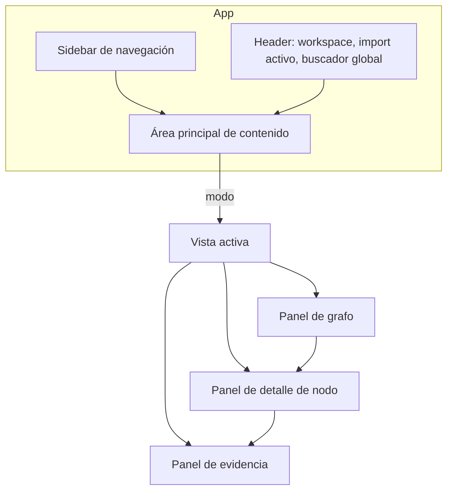

# 10. Interfaz de Usuario

> **Capítulo 10 de 15** — Vistas del sistema y arquitectura del frontend. La UI es un consumidor de la API interna (PR-02) y está orientada a la exploración del grafo de conocimiento.

---

## 10.1 Principios de UX

1. **Navegación sobre conocimiento, no sobre tráfico**: la unidad de interacción es el nodo/relación, no la petición. La petición es siempre accesible (trazabilidad), pero no es el punto de partida.
2. **Confianza visible**: cada relación muestra su nivel de confianza (Evidencia/Inferencia/Hipótesis) de forma distinguible visualmente.
3. **Vistas por pregunta**: no un único grafo, sino perspectivas adaptadas a cada pregunta de auditoría.
4. **De lo general a lo concreto**: resumen → subgrafo → nodo → evidencia → exchange raw.
5. **Acciones con un clic**: abrir la petición original, crear una consulta, re-correlacionar, marcar falsos positivos.

## 10.2 Layout general de la aplicación



## 10.3 Vistas del sistema

### 10.3.1 Vista "Flujo de Autenticación"

Muestra el ciclo completo de autenticación:

```
POST /auth/login ──EMITS──► JWT ──GRANTS──► roles/scopes
      │                       │
      │                       ├──AUTHORIZES──► GET /users/{id}
      │                       ├──AUTHORIZES──► POST /orders
      └──EMITS──► RefreshToken ──REFRESHES──► nuevo JWT
POST /auth/logout
```

Interacciones:
- Expandir el nodo JWT → ver todos los endpoints que lo consumen.
- Comparar dos tokens lado a lado (claims, scopes).
- Saltar al timeline de su emisión y caducidad.

### 10.3.2 Vista "Recursos"

Navegación por objetos de negocio y recursos:

```
[Orders]  o:c_1001  ──► [Payments]  pay_88 ──► [Invoices] inv_55
   │  o:c_1002  ──► [Customers] c_1001
```

Interacciones:
- Agrupar por tipo de recurso, ordenar por cardinalidad.
- `LINKS_TO` muestra el mismo valor en distintos módulos.
- Clic en recurso → lista de endpoints que lo devuelven/aceptan.
- Ver "recorrido completo" del objeto (camino hasta profundidad configurable).

### 10.3.3 Vista "Infraestructura"

```
gateway.example.com ──► orders-service ──► api.orders.example.com
                      ──► payment-service ──► api.payment.example.com ──► externo: stripe.com
```

Interacciones:
- Colapsar/expandir por servicio.
- Resaltar hosts sin TLS (regla R-INFRA-001).
- Ver qué endpoints expone cada servicio.

### 10.3.4 Vista "Permisos"

Relaciones entre roles, scopes, tokens y endpoints:

```
Role: admin ──GRANTS──► JWT ──AUTHORIZES──► Endpoint ──REQUIRES──► Scope: read:orders
```

Interacciones:
- Matriz "endpoint × scope" (qué endpoints requieren qué scopes).
- Detectar endpoints sin `PROTECTS` observado (hipótesis).
- Cruzar con alertas de tokens sobreprivilegiados (R-TOK-002).

### 10.3.5 Vista "Timeline"

Reproducción cronológica de la navegación.

- Filtros por principal/sesión, host, método, endpoint.
- Cada evento abre el exchange original (request/response completos).
- Anclaje del timeline a la emisión de un token específico para ver su ciclo de vida.
- Marcadores de eventos clave (login, refresh, logout, errores 401/403).

### 10.3.6 Vista "Alertas"

Gestión del ciclo de vida de alertas (capítulo 8.7):

- Panel con filtros (severidad, categoría, estado).
- Detalle con `context_subgraph` renderizado en el panel de grafo.
- Acciones: `TRIAGED`, `CONFIRMED`, `FALSE_POSITIVE`, notas, etiquetas.
- Exportar informe (Markdown/PDF en v2).

### 10.3.7 Vista "Consulta" (Query Console)

Consola de Cypher con sandbox (mismo motor que `POST /graph/query`):

- Autocompletado de labels/propiedades desde el esquema.
- Historial de consultas guardadas.
- Resultados tabulares y opción "enviar al grafo" (renderizar resultado como subgrafo).
- Previsualización de reglas (dry-run) desde el editor de reglas.

## 10.4 Panel de grafo (Cytoscape.js)

### 10.4.1 Configuración de estilos

| Tipo de nodo | Color | Forma |
|--------------|-------|-------|
| `Endpoint` | azul | rectángulo |
| `Token` / `Cookie` | naranja | hexágono |
| `Resource` / `BusinessObject` | verde | elipse |
| `Role` / `Scope` / `Principal` | morado | diamante |
| `Host` / `Service` / `External` | gris | rectángulo redondeado |
| `Hypothesis` | punteado amarillo | punteado |

| Relación | Estilo |
|----------|--------|
| `EVIDENCIA` | línea continua |
| `INFERENCIA` | línea discontinua |
| `HIPOTESIS` | línea punteada |

### 10.4.2 Layouts

- `cose` para exploración general.
- `breadthfirst` para flujos de autenticación y recursos (top-down).
- `concentric` para análisis de centralidad.
- Layout por vista predefinido, conmutable por el usuario.

### 10.4.3 Interacciones

- Hover → tooltip con propiedades esenciales.
- Clic → panel de detalle.
- Doble clic → expandir vecinos (1 salto).
- Selección múltiple → comparación (p. ej., dos JWT).
- Filtro por confianza/import en la barra lateral.

## 10.5 Panel de detalle de nodo

| Sección | Contenido |
|---------|-----------|
| Identidad | label, clave natural, tipo |
| Propiedades | todas las propiedades del nodo |
| Confianza | nivel + score + evidencias (exchange_ids) |
| Relaciones | lista paginada con tipos y direcciones |
| Acciones | "abrir evidencias", "expandir vecinos", "buscar caminos a...", "crear alerta" |

## 10.6 Panel de evidencia / exchange raw

- Request y response completos en paneles lado a lado (estilo Burp).
- Resaltado de valores sensibles redactados (badge "redactado").
- Vínculos directos: "este JWT → nodo token", "este customerId → recurso".
- Copiar como curl (con redacción).

## 10.7 Arquitectura del frontend

```
ui/
├── src/
│   ├── app/            # Rutas, layout, providers
│   ├── api/            # Cliente OpenAPI generado
│   ├── features/
│   │   ├── auth-flow/
│   │   ├── resources/
│   │   ├── infrastructure/
│   │   ├── permissions/
│   │   ├── timeline/
│   │   ├── alerts/
│   │   ├── query/
│   │   └── import/
│   ├── components/graph/   # Cytoscape wrapper, estilos, layouts
│   ├── components/ui/      # Radix primitives
│   ├── state/              # Zustand stores
│   └── lib/                # utilidades, formatos, hashing client
├── e2e/                     # Playwright
└── openapi.client.ts        # Generado desde openapi.v1.yaml
```

## 10.8 Estado y datos

- **TanStack Query**: cache y sincronización con la API (invalidación por `import_id`).
- **Zustand**: estado de UI (vista activa, selección, filtros).
- **SSE**: suscripción a eventos de progreso de importación.
- El estado del grafo se serializa/deserializa del formato Cytoscape que devuelve la API (`views/*`, `context_subgraph`).

## 10.9 Rendimiento de la UI

| Estrategia | Detalle |
|------------|---------|
| Subgrafos acotados | Máx. 500 nodos/1200 aristas por render |
| Virtualización de listas | Paneles de evidencia, timeline, alertas |
| Debounce de consultas | Búsquedas globales |
| Code-splitting | Por feature (lazy loading de vistas pesadas) |
| Worker de layout | Layout de grafos grandes en Web Worker (v1.0) |

## 10.10 Accesibilidad e idioma

- Soporte multi-idioma (ES/EN) mediante i18n (v1.0).
- Contraste y navegación por teclado en paneles principales.
- Modo oscuro/claro (Radix themes).

## 10.11 Demo y onboarding

- Workspace de ejemplo con dataset sintético (v0.1) para evaluar el producto sin capturar tráfico.
- Tutorial guiado de las cinco vistas principales.
