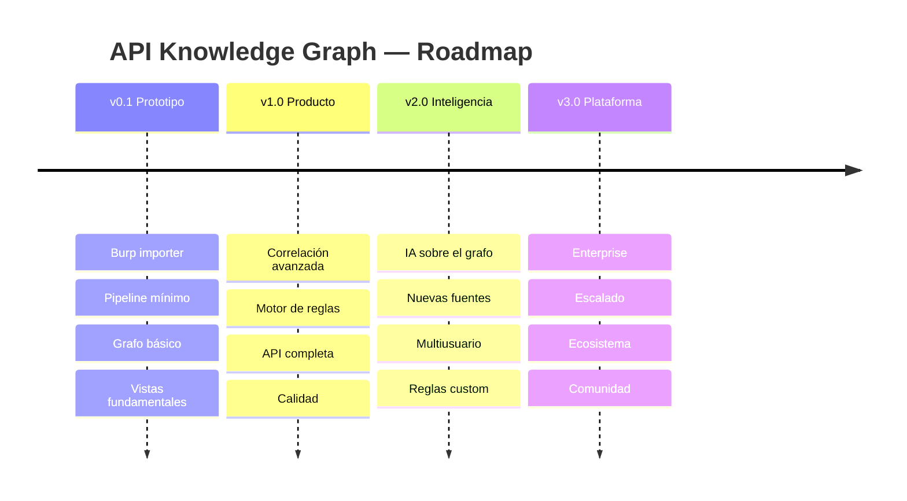
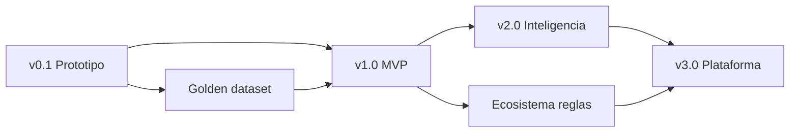

# 13. Hoja de Ruta por Versiones

> **Capítulo 13 de 15** — Plan de evolución del producto: v0.1 (prototipo), v1.0 (producto utilizable), v2.0 (IA + fuentes + multiusuario), v3.0 (plataforma/enterprise).

---

## 13.1 Visión general del roadmap

| Versión | Enfoque | Estado objetivo | Aprox. duración |
|---------|---------|-----------------|-----------------|
| v0.1 | Prototipo funcional | Probar hipótesis con datos reales | 6–8 semanas |
| v1.0 | Producto MVP usable | Validar con auditores | 3–4 meses |
| v2.0 | Inteligencia y escala | Investigación + producto avanzado | 6–9 meses |
| v3.0 | Plataforma | Producto comercial/community | 9–12 meses |

## 13.2 v0.1 — Prototipo

### 13.2.1 Objetivo

Demostrar el concepto central: **transformar un export de Burp Logger en un grafo navegable**. Validar la hipótesis H1 y las técnicas de correlación básica.

### 13.2.2 Alcance

**Importación**
- [x] Adaptador `BurpJsonAdapter` (JSON de Burp Logger).
- [ ] Adaptador `BurpCsvAdapter` (CSV).
- [ ] Modelo canónico `HttpExchange` (Pydantic).
- [ ] Validación de formato e integridad.
- [ ] Parseo de headers, cookies, query, cuerpos JSON.

**Normalización**
- [ ] Clasificación de segmentos (fixed/numeric/uuid/hash/mixed).
- [ ] Generación de plantillas `GET /users/{id}`.
- [ ] `endpoint_values` (valores únicos por parámetro).
- [ ] Segmentos protegidos configurables.

**Extracción**
- [ ] Detección de JWT (estructura + claims básicos).
- [ ] Detección de cookies y sesiones.
- [ ] Detección de `json_id` por paths canónicos.
- [ ] Detección de roles/scopes desde claims.
- [ ] `entity_occurrences` con `value_hash`.

**Correlación (básica)**
- [ ] Token → `EMITS`/`CONSUMES`/`AUTHORIZES`.
- [ ] Endpoint → `RETURNS`/`ACCEPTS` de recursos.
- [ ] Mismo valor en distintos endpoints → `LINKS_TO` (inferencia).
- [ ] Nivel de confianza `EVIDENCIA`/`INFERENCIA` básico.
- [ ] Detección de AuthFlow simple (login→token→uso).

**Grafo**
- [ ] Esquema v1 en Neo4j (nodos base, índices).
- [ ] Materializer en batch (UNWIND).

**API (mínima)**
- [ ] `POST /imports`, `GET /imports/{id}` con progreso.
- [ ] `GET /graph/summary`, `POST /graph/query` (sandbox).
- [ ] `GET /endpoints`, `GET /entities`, `GET /exchanges/{id}`.

**UI (mínima)**
- [ ] Importación con progreso en vivo (SSE).
- [ ] Vista Flujo de Autenticación.
- [ ] Vista Recursos (básica).
- [ ] Panel de detalle de nodo + evidencia.
- [ ] Vista Timeline (básica).

**Infra**
- [ ] Docker Compose (api, 1 worker, postgres, neo4j, redis, ui).
- [ ] Migraciones Alembic + Cypher idempotente.
- [ ] CI básico (lint, test, build).

### 13.2.3 Criterios de salida de v0.1

1. Un dataset sintético de 10k exchanges se procesa en < 60 s.
2. La vista de Auth Flow reconstruye login→token→uso correctamente en el dataset.
3. Se responde Q1–Q3 de la sección 1.2.1 sin intervención manual.
4. El esquema del grafo está versionado y documentado.

### 13.2.4 Entregables de investigación

- Primer dataset real etiquetado (golden dataset pequeño, ~5k exchanges).
- Métricas preliminares de precisión de correlación.

---

## 13.3 v1.0 — Producto MVP

### 13.3.1 Objetivo

Producto **utilizable por auditores** en auditorías reales: correlación robusta, motor de reglas, vistas completas, API estable.

### 13.3.2 Alcance

**Importación**
- [ ] Robustez del parser Burp (archivos corruptos, truncados, errores por entrada).
- [ ] Límites de tamaño y manejo de datasets de 100k+.
- [ ] Cancelación y reanudación de importaciones.

**Normalización**
- [ ] Naming semántico de parámetros (`userId`, `orderId`).
- [ ] Detección de host_pattern y agrupación de servicios (heurísticas).
- [ ] Anti-sobre-normalización (listas, umbrales por import).

**Correlación completa**
- [ ] Resolución de identidad (familias de equivalencia de labels).
- [ ] Cadenas temporales `NEXT` y ventanas de sesión.
- [ ] AuthFlow completo (login, refresh, logout, oauth básico).
- [ ] `REFERENCES` entre recursos (paths anidados, URLs en body).
- [ ] Refinamiento de score y umbral de descarte.
- [ ] Hipótesis CRUD (métodos faltantes).

**Motor de reglas**
- [ ] DSL completo (when/where/emit) + JSON Schema.
- [ ] Motor de ejecución con sandbox, timeout, deduplicación.
- [ ] Catálogo v1 (R-AUTH/R-TOK/R-IDOR/R-DATA/R-INFRA/R-HYP).
- [ ] Ciclo de vida de alertas + `context_subgraph`.
- [ ] Dry-run de reglas.

**API completa**
- [ ] Todos los endpoints del capítulo 9 (workspaces, alerts, rules, views, entities).
- [ ] Autenticación con API key.
- [ ] Contrato OpenAPI v1 versionado.
- [ ] SSE de eventos de importación.
- [ ] Paginación por cursor.

**UI**
- [ ] Vista Permisos.
- [ ] Vista Infraestructura.
- [ ] Panel de Alertas completo (triaje, notas, exportar).
- [ ] Query Console con autocompletado.
- [ ] Rendimiento (virtualización, layouts en worker).
- [ ] i18n ES/EN.
- [ ] Workspace de demo (dataset sintético).

**Operaciones**
- [ ] Topología Compose multi-nodo.
- [ ] Telemetría OTel + Prometheus/Grafana + alertas operativas.
- [ ] Backups documentados y runbook.
- [ ] E2E con Playwright.

**Calidad**
- [ ] Cobertura ≥ 85%.
- [ ] Golden dataset ampliado (~50k exchanges) con etiquetas.
- [ ] Métricas de precisión/recall/F1 publicadas.
- [ ] Evaluación de la precisión de reglas (< 20% FP en categorías principales).

### 13.3.3 Criterios de salida de v1.0

1. Importación de 100k exchanges en < 10 min (hardware de referencia).
2. Correlación con precisión > 90% en golden dataset.
3. Catálogo de reglas ejecutable sobre datasets reales con FP < 20%.
4. API estable (v1) consumida por la UI y usable por scripting.
5. Auditoría de referencia completada con la herramienta por un analista externo (validación de valor).

---

## 13.4 v2.0 — Inteligencia y Escala

### 13.4.1 Objetivo

Incorporar **IA sobre el conocimiento estructurado** (no sobre tráfico crudo), nuevas fuentes de importación y soporte multiusuario. Apertura a investigación avanzada.

### 13.4.2 Alcance

**Nuevas fuentes de importación**
- [ ] Adaptador HAR 1.2.
- [ ] Adaptador OpenAPI 3.x / Swagger (como complemento de estructura, no de tráfico).
- [ ] Adaptador Postman Collection.
- [ ] Adaptador mitmproxy.
- [ ] Fusión de múltiples fuentes en un mismo workspace (merge de evidencias).

**IA sobre el grafo**
- [ ] Servicio de preguntas en lenguaje natural sobre el grafo (subconjunto acotado).
- [ ] Selección de subgrafo relevante (retrieval) + contexto para el LLM.
- [ ] Respuestas con citas de evidencia (cada afirmación referenciada a nodos/relaciones).
- [ ] Resúmenes automáticos por vista (autenticación, permisos, recursos).
- [ ] Descubrimiento de hipótesis guiado por IA (fuente adicional del `Hypothesis Engine`).
- [ ] Evaluación: alucinaciones controladas vía citas y validación de patrones del grafo.

**Multiusuario**
- [ ] Usuarios, sesiones JWT, roles (admin/auditor/viewer).
- [ ] Workspaces privados/compartidos.
- [ ] RBAC por workspace.
- [ ] Auditoría de accesos.

**Reglas avanzadas**
- [ ] Reglas personalizadas por usuario (UI + API).
- [ ] Rulesets por perfil (default, PCI-DSS, OWASP API Top 10).
- [ ] Preview/simulación de reglas.
- [ ] Mejora automática de reglas desde falsos positivos confirmados (sugerencias).

**Escalado**
- [ ] Helm charts preliminares.
- [ ] Particionamiento robusto de evidencia.
- [ ] Réplicas de lectura de PostgreSQL.
- [ ] Algoritmos GDS (centralidad, comunidades) para descubrimiento.

**Investigación**
- [ ] Paper/s sobre correlación automática de tráfico HTTP.
- [ ] Datasets públicos de referencia (anonymized).
- [ ] Benchmark reproducible del pipeline.

### 13.4.3 Criterios de salida de v2.0

1. Responder las preguntas Q1–Q7 en lenguaje natural con citas verificables.
2. Al menos 4 fuentes de importación operativas con merge.
3. Multiusuario estable con RBAC.
4. Métricas de IA: ≥ 95% de respuestas con citas correctas en evaluación.

---

## 13.5 v3.0 — Plataforma

### 13.5.1 Objetivo

Posicionar la herramienta como la referencia del dominio (**BloodHound de las APIs**): producto enterprise, ecosistema de reglas, integraciones y escalado masivo.

### 13.5.2 Alcance

**Enterprise**
- [ ] SSO/OIDC, MFA, RBAC granular.
- [ ] Alta disponibilidad (HA) de todos los componentes.
- [ ] Multi-tenant aislado (datos cifrados por tenant).
- [ ] Compliance (auditoría completa, borrado seguro, DLP).
- [ ] SLOs contractuales y dashboards de uso.

**Escalado masivo**
- [ ] Kubernetes + autoescalado por etapa.
- [ ] Ingesta por streaming (OpenTelemetry spans, agentes).
- [ ] Capa fría (S3/Parquet) para retención de largo plazo.
- [ ] Neo4j Enterprise / clúster con réplicas de lectura.

**Ecosistema**
- [ ] Reglas de la comunidad (marketplace).
- [ ] Webhooks a SIEM/ticketing (Splunk, TheHive, Jira).
- [ ] Plugins de integración (Burp, ZAP, Postman, VS Code).
- [ ] SDK multilingüe (Python/Go) sobre la API.
- [ ] Exportación de informes (PDF, reporte de auditoría).

**Fuentes avanzadas**
- [ ] Adaptador PCAP/PCAPng.
- [ ] Adaptador OpenTelemetry (trazas → flujos).
- [ ] Adaptador Fiddler y proxies corporativos.
- [ ] Detección activa opcional (envío controlado para validar hipótesis, con consentimiento).

**Investigación/producto**
- [ ] Estudio longitudinal: ahorro de tiempo medido en auditorías reales.
- [ ] Modelo de negocio (open-core: Community + Enterprise).
- [ ] Documentación pública, sitio, comunidad.

### 13.5.3 Criterios de salida de v3.0

1. Despliegue HA con SLO ≥ 99.9%.
2. 1M+ exchanges procesados por importación de forma sostenida.
3. Ecosistema: ≥ 10 reglas de la comunidad + 3 integraciones de terceros.
4. Adopción: N auditorías reales reportadas (métrica de valor).

---

## 13.6 Dependencias entre hitos

- El **golden dataset** es la dependencia crítica de investigación: sin métricas, la correlación y las reglas no pueden validarse.
- v2.0 depende de la **estabilidad del esquema del grafo** (v1.x) para entrenar/evaluar IA.
- v3.0 depende de la **API estable** para el ecosistema externo.

## 13.7 Gestión de riesgos por versión

| Versión | Riesgo principal | Mitigación |
|---------|------------------|------------|
| v0.1 | Correlación demasiado ruidosa | Golden dataset pequeño, métricas tempranas, umbrales ajustables |
| v1.0 | Falsos positivos en reglas | Evaluación con FP < 20%, dry-run, severidad graduada |
| v2.0 | Alucinaciones de IA | Citas obligatorias, subgrafo acotado, validación de patrones |
| v3.0 | Scope creep enterprise | Open-core, priorización por demanda de comunidad |

## 13.8 Backlog técnico transversal

- Mejoras de rendimiento del pipeline (parsing paralelo, protocolo).
- Herramientas de debugging del grafo (explicación de por qué existe una relación).
- Esquema del grafo v2 (migraciones).
- Internacionalización completa.
- Documentación de usuario y manual de auditoría.

## 13.9 Definición de "Done" transversal

Una feature se considera completa cuando cumple:

1. Código con tests (unit + integración) y cobertura adecuada.
2. Contracto OpenAPI actualizado si afecta a la API.
3. Migraciones (Alembic/Cypher) versionadas y reversibles.
4. Documentación técnica del módulo (dentro del SAD o en el repo).
5. Métricas/telemetría si es componente del pipeline.
6. Sin regresiones en el golden dataset (si afecta correlación/reglas).
